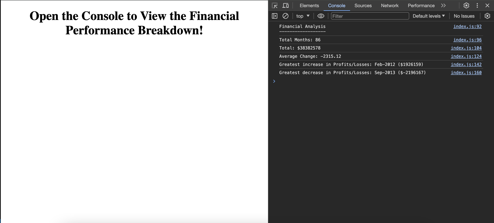

# Console Finances

## Description

This webpage does not contain any noteworthy UI or content, but instead functions via console logs which express a financial analysis. Having been provided with an array containing month-by-month financial records, the application uses a variety of javascript functions to interpret the data and surface a number of calculations which combine to act as a financial performance breakdown.

**Calculations include:**
* Total number of months in the array
* The net total amount of Profit/Losses over the seven year period
* The average of the changes in Profit/Losses over the seven year period
* The greatest increase (and month in which it occurred) in Profit/Losses over the seven year period
* The greatest decrease (and month in which it occurred) in Profit/Losses over the seven year period

## Installation

To review this application, please follow this URL: https://michaelfriel.github.io/console-finances/

The code is available to be cloned from the **console-finances** repository, using git commands. To access this, please follow this URL: https://github.com/MichaelFriel/console-finances

## Usage

The usage for this application is less conventional, as the function is not visible upon initial page load. 
In order to view the financial analysis:
* Load webpage in Google Chrome (or other browser which supports console access).
* Inspect the webpage and navigate to the console.
* You will then be able to view the financial analysis, expressed via console logs.

## License

Please see Mit License contained within repository.